  <picture>
    <source media="(prefers-color-scheme: dark) and (max-width: 600px)" srcset="./assets/profile-mobile-dark.svg">
    <source media="(prefers-color-scheme: light) and (max-width: 600px)" srcset="./assets/profile-mobile-light.svg">
    <source media="(prefers-color-scheme: dark)" srcset="./assets/profile-desktop-dark.svg">
    
  </picture>

Most of what I build is private. The tools I publish start as things I need: [toks](https://github.com/Luzivog/toks) and [agentdictate](https://github.com/Luzivog/agentdictate).
